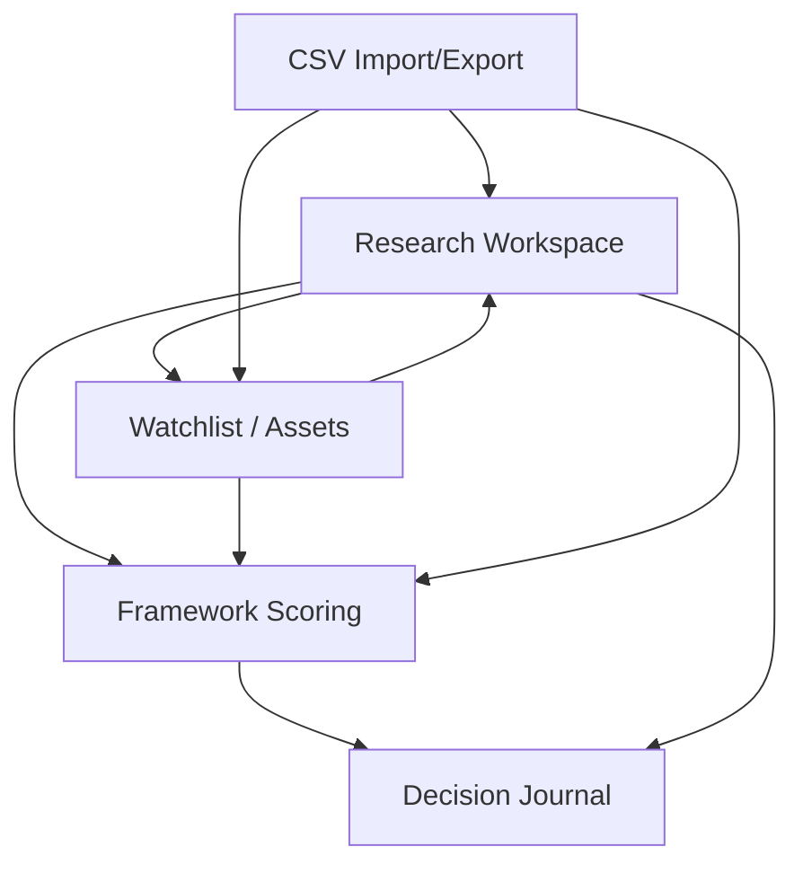
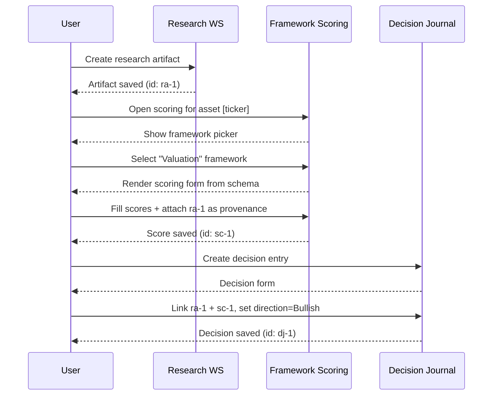
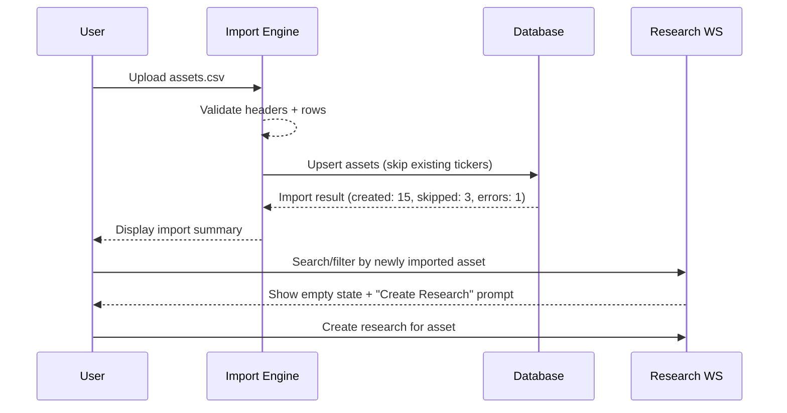
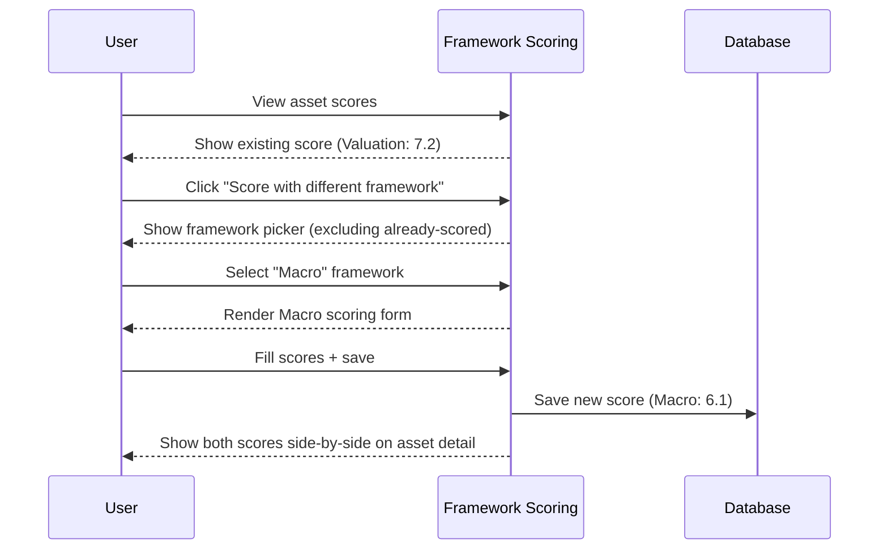
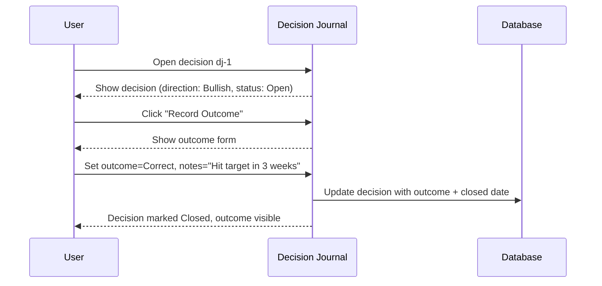
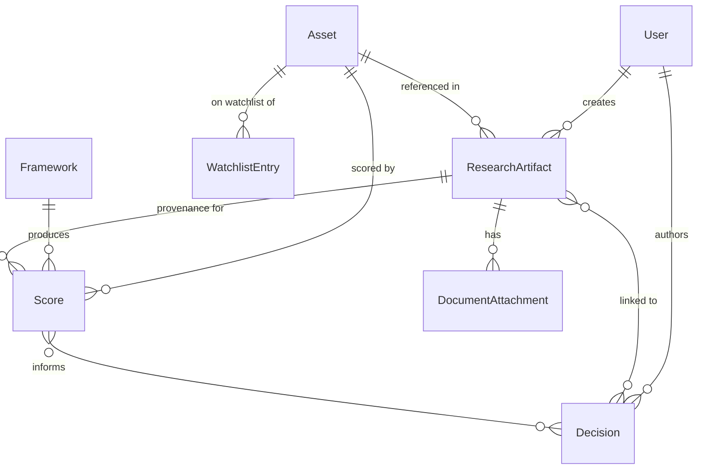

# Eugene Finance – Investment Decision Platform

## MVP Implementation Specification

**Version:** 1.0  
**Date:** 2026-06-08  
**Status:** P0 Implementation-Ready  

---

## Table of Contents

1. [Product Architecture](#1-product-architecture)
2. [Information Architecture](#2-information-architecture)
3. [Core User Flows](#3-core-user-flows)
4. [Data Model / Entity Model](#4-data-model--entity-model)
5. [P0 Feature Breakdown](#5-p0-feature-breakdown)
6. [P0 vs P1 Boundary](#6-p0-vs-p1-boundary)
7. [Acceptance Criteria](#7-acceptance-criteria)
8. [Technical Implementation Plan](#8-technical-implementation-plan)
9. [Recommended Stack](#9-recommended-stack)
10. [File / Module Structure](#10-file--module-structure)
11. [Key Risks and Mitigation](#11-key-risks-and-mitigation)
12. [Testing Strategy](#12-testing-strategy)
13. [Open Implementation Questions](#13-open-implementation-questions)

---

## 1. Product Architecture

### 1.1 Architecture Style

**Full-stack monolith** using Next.js 14+ App Router. One deployable unit contains the frontend, API layer, and data access layer. This minimizes operational overhead for a solo founder and avoids distributed system complexity.

### 1.2 Module Dependency Flow

The Research Workspace is the canonical source of truth. All other modules originate from and link back to research artifacts.



**Rule:** No module may hold canonical data that duplicates Research Workspace content. Watchlist holds references; Scoring holds framework outputs; Decisions hold journal entries — all link back.

### 1.3 Layer Separation

| Layer | Responsibility | Technology |
|---|---|---|
| Presentation | UI components, pages, layouts | React Server Components + Client Components, shadcn/ui |
| API | Route handlers, server actions, input validation | Next.js Route Handlers, Zod schemas |
| Domain | Business logic, scoring computation, provenance tracking | Plain TypeScript functions (no framework dependency) |
| Data | ORM access, migrations, seeding | Prisma Client + SQLite |
| Storage | File I/O for attachments and CSV | IStorageProvider interface, local filesystem impl |

### 1.4 Deployment Architecture (P0)

```
┌──────────────────────────────────────┐
│           Next.js Monolith           │
│  ┌──────────┐  ┌──────────────────┐  │
│  │  UI /     │  │  API Routes /    │  │
│  │  Pages    │  │  Server Actions  │  │
│  └────┬─────┘  └────────┬─────────┘  │
│       │                  │            │
│  ┌────▼──────────────────▼─────────┐  │
│  │       Domain Layer             │  │
│  └────────────────┬───────────────┘  │
│                   │                   │
│  ┌────────────────▼───────────────┐  │
│  │  Prisma ──► SQLite (local)     │  │
│  │  IStorage ──► Local FS         │  │
│  └────────────────────────────────┘  │
└──────────────────────────────────────┘
       │
       ▼
  localhost:3000
```

### 1.5 Future Migration Path (P1+)

- SQLite → PostgreSQL: Change Prisma provider, run `prisma migrate`. No domain logic changes.
- Local FS → S3/R2: Swap `LocalStorageProvider` for `S3StorageProvider`. Interface unchanged.
- Single-user → Multi-user: Add `userId` foreign keys to entities, add row-level authorization middleware.
- Localhost → Vercel: Add Vercel adapter, externalize DB and file storage.

---

## 2. Information Architecture

### 2.1 Navigation Structure

Hub-and-spoke model centered on the Research Workspace. Every top-level section is reachable in one click, and every item links back to its research origin.

```
┌─────────────────────────────────────────────┐
│                  Top Nav                     │
│  Research | Assets | Scores | Decisions      │
├─────────────────────────────────────────────┤
│                                              │
│  ┌─────────────┐    ┌──────────────────┐     │
│  │  Research    │◄───│  Asset Detail    │     │
│  │  Workspace   │───►│  (watchlist +    │     │
│  │  (HUB)       │    │   scores +       │     │
│  └──────┬───────┘    │   decisions)     │     │
│         │            └──────────────────┘     │
│         │                                      │
│  ┌──────▼───────┐    ┌──────────────────┐     │
│  │  Framework   │───►│  Decision        │     │
│  │  Scores      │    │  Journal         │     │
│  └──────────────┘    └──────────────────┘     │
│                                              │
├─────────────────────────────────────────────┤
│  Import/Export (accessible from any section) │
└─────────────────────────────────────────────┘
```

### 2.2 IA Tree

```
/
├── /research                    # Research Workspace (home)
│   ├── /research/new            # Create new artifact
│   ├── /research/[id]           # View/edit artifact
│   └── /research?q=&tag=        # Search/filter
├── /assets                      # Asset list + watchlist
│   ├── /assets/[ticker]         # Asset detail (scores, research, decisions)
│   └── /assets/new              # Add asset manually
├── /scores                      # Framework scores overview
│   └── /scores/[id]             # Score detail with provenance
├── /decisions                   # Decision journal
│   ├── /decisions/new           # New decision entry
│   └── /decisions/[id]          # Decision detail + outcome
└── /settings                    # Framework config, import/export, auth
    ├── /settings/frameworks     # Manage framework definitions
    └── /settings/data           # CSV import/export
```

### 2.3 Linking Convention

Every cross-module reference uses a stable identifier:

| From | To | Link Mechanism |
|---|---|---|
| Research Artifact | Asset | `assetTicker` field on artifact |
| Score | Research Artifact | `researchArtifactId` on score |
| Score | Asset | `assetTicker` on score |
| Decision | Research Artifact | `decision.researchLinks[]` (many-to-many) |
| Decision | Score | `decision.scoreLinks[]` (many-to-many) |
| Watchlist Entry | Asset | `assetTicker` on entry |

All link displays show a clickable badge that navigates to the linked entity.

---

## 3. Core User Flows

### 3.1 Flow 1: Research → Score → Decision

The primary value flow. A user researches an asset, scores it, then journals the decision.



**Steps:**
1. User navigates to `/research/new`, creates artifact with title, content, tags, and linked asset ticker.
2. User navigates to asset detail page, clicks "Score with Framework".
3. System shows framework picker (Valuation / Macro / Trend). User selects one.
4. System renders scoring form from framework's JSON schema. User fills in factor scores (0–10 scale per factor), adds notes per factor.
5. User attaches the research artifact as provenance source. Score is saved with `provenance` field recording source artifact ID, timestamp, and any manual overrides.
6. User navigates to `/decisions/new`, fills in decision title, direction, rationale.
7. User links research artifact(s) and score(s). Decision is saved.

### 3.2 Flow 2: CSV Import → Populate Assets → Research

User imports a CSV of assets, then begins researching them.



**Steps:**
1. User navigates to `/settings/data`, selects "Import Assets".
2. User uploads CSV. Required columns: `ticker`, `name`. Optional: `sector`, `assetType`, `exchange`.
3. System validates headers, checks for duplicate tickers (upsert logic), reports errors row-by-row.
4. Assets appear in `/assets` list. User clicks an asset, sees empty research tab with "Create Research" CTA.
5. User creates first research artifact linked to that asset.

### 3.3 Flow 3: Switch Framework → Re-Score → Compare

User wants to evaluate the same asset under a different framework.



**Steps:**
1. User views asset detail, sees existing score(s) in the Scores panel.
2. User clicks "Score with different framework". System shows frameworks not yet applied to this asset.
3. User selects a different framework, fills the scoring form, saves.
4. Asset detail now shows both scores side-by-side with framework labels and computed composites.

### 3.4 Flow 4: Journal Decision → Later Review Outcome

User records a decision and later revisits to log the outcome.



**Steps:**
1. User opens a past decision from `/decisions`.
2. Decision is "Open" (no outcome yet). User clicks "Record Outcome".
3. System presents outcome form: result (Correct / Incorrect / Partial), actual return (optional), notes.
4. User fills in and saves. Decision status changes to "Closed". Outcome is visible in the decision timeline and in the asset's decision history.

---

## 4. Data Model / Entity Model

### 4.1 ER Diagram



### 4.2 Prisma Schema

```prisma
// prisma/schema.prisma

generator client {
  provider = "prisma-client-js"
}

datasource db {
  provider = "sqlite"
  url      = env("DATABASE_URL") // defaults to file:./dev.db
}

model User {
  id               String   @id @default(cuid())
  email            String   @unique
  name             String?
  passwordHash     String
  createdAt        DateTime @default(now())
  updatedAt        DateTime @updatedAt

  researchArtifacts ResearchArtifact[]
  decisions         Decision[]
}

model Asset {
  ticker     String   @id // e.g. "AAPL", "BTC-USD"
  name       String
  sector     String?  // e.g. "Technology", "Crypto"
  assetType  String   @default("equity") // equity | crypto | fx | commodity | other
  exchange   String?
  notes      String?
  createdAt  DateTime @default(now())
  updatedAt  DateTime @updatedAt

  researchArtifacts ResearchArtifact[]
  scores           Score[]
  watchlistEntries WatchlistEntry[]
}

model Framework {
  id              String   @id @default(cuid())
  name            String   @unique // "Valuation", "Macro", "Trend"
  slug            String   @unique // "valuation", "macro", "trend"
  description     String?
  schemaDefinition String  // JSON: defines factors, weights, scoring range
  isActive        Boolean  @default(true)
  createdAt       DateTime @default(now())
  updatedAt       DateTime @updatedAt

  scores Score[]
}

model ResearchArtifact {
  id          String   @id @default(cuid())
  title       String
  content     String   // TipTap JSON or markdown
  contentType String   @default("rich-text") // rich-text | markdown | note
  tags        String   // comma-separated tags
  assetTicker String?
  asset       Asset?   @relation(fields: [assetTicker], references: [ticker], onDelete: SetNull)
  authorId    String
  author      User     @relation(fields: [authorId], references: [id], onDelete: Cascade)
  createdAt   DateTime @default(now())
  updatedAt   DateTime @updatedAt

  attachments DocumentAttachment[]
  scores      Score[]
  decisions   DecisionResearchLink[]
}

model DocumentAttachment {
  id              String   @id @default(cuid())
  fileName        String
  filePath        String   // relative path within storage root
  mimeType        String
  fileSizeBytes   Int
  researchArtifactId String
  researchArtifact    ResearchArtifact @relation(fields: [researchArtifactId], references: [id], onDelete: Cascade)
  createdAt       DateTime @default(now())
}

model Score {
  id                String   @id @default(cuid())
  frameworkId       String
  framework         Framework @relation(fields: [frameworkId], references: [id], onDelete: Cascade)
  assetTicker       String
  asset             Asset   @relation(fields: [assetTicker], references: [ticker], onDelete: Cascade)
  researchArtifactId String? // provenance: which research artifact informed this score
  researchArtifact  ResearchArtifact? @relation(fields: [researchArtifactId], references: [id], onDelete: SetNull)
  factorScores      String  // JSON: { "factor_slug": { "value": 7, "note": "..." } }
  compositeScore    Float?  // computed from factors + weights, null if manually overridden
  manualOverride    Boolean @default(false)
  overrideNote      String?
  provenance        String  // JSON: { source: "research|manual|csv", artifactId?, timestamp, note }
  scoredAt          DateTime @default(now())
  createdAt         DateTime @default(now())
  updatedAt         DateTime @updatedAt

  decisions DecisionScoreLink[]
}

model Decision {
  id          String   @id @default(cuid())
  title       String
  direction   String   // bullish | bearish | neutral
  thesis      String   // primary rationale (text)
  status      String   @default("open") // open | closed
  outcome     String?  // correct | incorrect | partial
  outcomeNote String?
  outcomeDate DateTime?
  authorId    String
  author      User     @relation(fields: [authorId], references: [id], onDelete: Cascade)
  createdAt   DateTime @default(now())
  updatedAt   DateTime @updatedAt

  researchLinks DecisionResearchLink[]
  scoreLinks    DecisionScoreLink[]
}

model DecisionResearchLink {
  decisionId         String
  researchArtifactId String
  decision           Decision         @relation(fields: [decisionId], references: [id], onDelete: Cascade)
  researchArtifact   ResearchArtifact @relation(fields: [researchArtifactId], references: [id], onDelete: Cascade)

  @@id([decisionId, researchArtifactId])
}

model DecisionScoreLink {
  decisionId String
  scoreId    String
  decision   Decision @relation(fields: [decisionId], references: [id], onDelete: Cascade)
  score      Score    @relation(fields: [scoreId], references: [id], onDelete: Cascade)

  @@id([decisionId, scoreId])
}

model WatchlistEntry {
  id          String   @id @default(cuid())
  assetTicker String
  asset       Asset    @relation(fields: [assetTicker], references: [ticker], onDelete: Cascade)
  notes       String?
  addedAt     DateTime @default(now())
}
```

### 4.3 Field-Level Notes

| Field | Notes |
|---|---|
| `Asset.ticker` | Primary key. Uppercase convention (e.g. `AAPL`, `BTC-USD`). Validated on insert. |
| `Framework.schemaDefinition` | JSON string defining the scoring factors. See §4.4 for schema structure. |
| `Score.factorScores` | JSON object keyed by factor slug. Each entry has `value` (0–10) and optional `note`. |
| `Score.compositeScore` | Auto-computed from `factorScores × framework weights`. Set to `null` and `manualOverride=true` if user overrides. |
| `Score.provenance` | Immutable audit record. Records whether the score came from research, manual entry, or CSV import, with timestamp. |
| `ResearchArtifact.content` | Stored as TipTap JSON for rich-text, or raw string for markdown/notes. `contentType` field determines rendering. |
| `ResearchArtifact.tags` | Comma-separated for P0 simplicity. Full tag entity deferred to P1. |
| `Decision.outcome` | Nullable until the user records a result. `status` transitions from `open` → `closed` on outcome entry. |

### 4.4 Framework SchemaDefinition Structure

Each framework defines its scoring factors in a JSON schema stored in `Framework.schemaDefinition`:

```json
{
  "version": 1,
  "factors": [
    {
      "slug": "intrinsic_value_discount",
      "label": "Intrinsic Value Discount",
      "description": "How large is the discount to intrinsic value?",
      "weight": 0.30,
      "range": { "min": 0, "max": 10 }
    },
    {
      "slug": "margin_of_safety",
      "label": "Margin of Safety",
      "description": "Is there a meaningful margin of safety?",
      "weight": 0.25,
      "range": { "min": 0, "max": 10 }
    },
    {
      "slug": "catalyst_clarity",
      "label": "Catalyst Clarity",
      "description": "Are there identifiable near-term catalysts?",
      "weight": 0.20,
      "range": { "min": 0, "max": 10 }
    },
    {
      "slug": "quality_moat",
      "label": "Quality / Moat",
      "description": "Does the asset have durable competitive advantages?",
      "weight": 0.15,
      "range": { "min": 0, "max": 10 }
    },
    {
      "slug": "sentiment_contrarian",
      "label": "Sentiment / Contrarian Signal",
      "description": "Is sentiment overly negative (bullish) or positive (bearish)?",
      "weight": 0.10,
      "range": { "min": 0, "max": 10 }
    }
  ],
  "compositeMethod": "weighted_average"
}
```

**Composite computation:** `compositeScore = Σ(factor.value × factor.weight)` where weights sum to 1.0.

### 4.5 Seed Data: Pre-Built Frameworks

Three frameworks ship with the application seed:

| Framework | Slug | Factor Count | Description |
|---|---|---|---|
| Valuation | `valuation` | 5 | Intrinsic value discount, margin of safety, catalyst clarity, quality/moat, sentiment/contrarian |
| Macro | `macro` | 4 | Regime alignment, rate sensitivity, fiscal tailwind, geopolitical risk (inverse) |
| Trend | `trend` | 4 | Price structure, momentum signal, volume confirmation, relative strength |

The **Multi-factor** framework is a P1 feature that composes scores from other frameworks. In P0, a user can manually compare framework scores side-by-side on the asset detail page.

---

## 5. P0 Feature Breakdown

### 5.1 Research Workspace

| # | Feature | Priority | Description |
|---|---|---|---|
| R1 | Create research artifact | Must | Form with title, rich-text editor, tag input, asset ticker link |
| R2 | Edit research artifact | Must | Inline edit with version tracking via `updatedAt` |
| R3 | Delete research artifact | Must | Soft consideration — warn if linked to scores/decisions |
| R4 | List research artifacts | Must | Paginated list sorted by `updatedAt` desc, with search + tag filter |
| R5 | Search research artifacts | Must | Full-text search on title + content (SQLite FTS5) |
| R6 | Tag research artifacts | Must | Comma-separated tag input, filter by tag on list view |
| R7 | Link to asset | Must | Optional `assetTicker` field, shown as badge on artifact |
| R8 | Upload attachments | Must | File upload (PDF, PNG, CSV, XLSX) attached to artifact |
| R9 | View attachment | Must | Inline preview for images, download link for others |
| R10 | Research detail page | Must | Full artifact view with content, tags, linked asset, attachments, linked scores/decisions |

### 5.2 Framework Switching and Scoring

| # | Feature | Priority | Description |
|---|---|---|---|
| F1 | Framework picker | Must | Dropdown or card selector showing active frameworks |
| F2 | Render scoring form from schema | Must | Dynamic form generated from `Framework.schemaDefinition` JSON |
| F3 | Submit score | Must | Save factor scores + compute composite |
| F4 | Attach research as provenance | Must | Optional link to a research artifact when scoring |
| F5 | Manual override | Must | User can override composite with custom value + note; sets `manualOverride=true` |
| F6 | Provenance record | Must | Every score stores immutable provenance JSON |
| F7 | View score history | Must | List all scores for an asset, grouped by framework |
| F8 | Side-by-side comparison | Must | View multiple framework scores for same asset on one page |
| F9 | Score detail page | Must | View full score with factor breakdown, provenance, linked research |

### 5.3 Decision Journal

| # | Feature | Priority | Description |
|---|---|---|---|
| D1 | Create decision | Must | Form with title, direction picker, thesis text |
| D2 | Link research artifacts | Must | Multi-select of research artifacts to attach |
| D3 | Link scores | Must | Multi-select of scores to attach |
| D4 | Decision list | Must | Paginated list filtered by status (open/closed), direction, date |
| D5 | Decision detail | Must | Full view with thesis, linked research/scores, outcome |
| D6 | Record outcome | Must | Form for outcome result, notes, actual return |
| D7 | Decision timeline | Must | Chronological view of all decisions for an asset |

### 5.4 Lightweight Watchlist / Asset Navigation

| # | Feature | Priority | Description |
|---|---|---|---|
| W1 | Add asset to watchlist | Must | From asset detail page, toggle watchlist status |
| W2 | Remove from watchlist | Must | Toggle off from asset detail or watchlist page |
| W3 | Watchlist view | Must | Simple table of watched assets with ticker, name, sector, notes |
| W4 | Asset list | Must | Paginated list of all assets, searchable |
| W5 | Asset detail page | Must | Hub view: profile + tabs for Research, Scores, Decisions |
| W6 | Manual price entry | Should | Optional `lastKnownPrice` and `priceDate` fields on Asset |
| W7 | Add asset manually | Must | Form with ticker, name, sector, assetType, exchange |

### 5.5 Manual Data Entry and CSV Import/Export

| # | Feature | Priority | Description |
|---|---|---|---|
| I1 | CSV import: Assets | Must | Upload CSV, validate, upsert. Required: ticker, name |
| I2 | CSV import: Scores | Should | Upload CSV of pre-computed scores with framework + factor values |
| I3 | CSV export: Assets | Must | Download all assets as CSV |
| I4 | CSV export: Scores | Must | Download all scores with factor breakdown as CSV |
| I5 | CSV export: Decisions | Must | Download all decisions as CSV |
| I6 | CSV export: Research index | Should | Download research artifact metadata (not full content) as CSV |
| I7 | Import summary report | Must | Show created/skipped/error counts after import |
| I8 | Validation errors | Must | Row-by-row error display for failed imports |

---

## 6. P0 vs P1 Boundary

### 6.1 Explicitly In Scope (P0)

- Single-user workspace
- Manual data entry for all entities
- CSV import for assets and scores; CSV export for all entities
- Three pre-built frameworks (Valuation, Macro, Trend) with JSON schema definitions
- Dynamic scoring form generation from schema
- Manual composite override with provenance tracking
- Rich-text research editor with file attachments
- Decision journal with research/score linking and outcome tracking
- Watchlist with manual price entry
- Full-text search on research artifacts (SQLite FTS5)
- Local-first deployment, SQLite storage, local filesystem for files

### 6.2 Explicitly Out of Scope (P0)

| Category | Deferred Feature | Reason |
|---|---|---|
| Trading | Auto trading, order execution | Out of product philosophy |
| Integration | Broker integration | Adds auth complexity, no P0 value |
| Social | Community features, chat, sharing | Single-user product |
| Data | Live market data feeds | Not a core dependency; manual-first |
| Analytics | Portfolio rollups, P&L tracking | Dashboard-centric, deferred |
| Framework | Multi-factor composite framework | Requires cross-framework scoring logic |
| Auth | Multi-user auth, roles, permissions | P0 is single-user |
| Infra | Cloud deployment, CDN, S3 | Local-first for P0 |
| UI | Dashboard-centric home page | Research-first philosophy |
| Data | Tag entity (full tag model) | Comma-separated tags sufficient |
| Data | Research version history (diff) | `updatedAt` timestamp sufficient |
| Data | Real-time notifications / alerts | No live data in P0 |

### 6.3 P1 Roadmap (Post-MVP)

1. Multi-factor framework (composite of Valuation + Macro + Trend)
2. PostgreSQL migration + cloud deployment on Vercel
3. Multi-user auth with role-based access
4. S3/R2 file storage
5. Live market data integration (optional, user-configurable)
6. Research version history with diff view
7. Full tag entity with autocomplete and tag management
8. Decision analytics (win rate, average return by framework)
9. Email/in-app alerts for watched assets
10. Portfolio position tracking (manual entry)
11. API for external integrations

---

## 7. Acceptance Criteria

### 7.1 Research Workspace

| ID | Criterion | Validation Method |
|---|---|---|
| AC-R1 | User can create a research artifact with title, content, tags, and optional asset link; it persists after page reload | Create artifact, reload page, verify presence |
| AC-R2 | User can edit any field of an existing research artifact; `updatedAt` timestamp changes | Edit title, save, verify timestamp updated |
| AC-R3 | User can delete a research artifact; linked scores/decisions show a warning before delete | Attempt delete with linked score, verify warning; confirm delete, verify removal |
| AC-R4 | Research list shows all artifacts sorted by most recently updated, paginated at 20 per page | Create 25+ artifacts, verify pagination and sort order |
| AC-R5 | Searching by keyword returns artifacts whose title or content matches; empty state is handled | Search for known keyword, verify result; search gibberish, verify empty state |
| AC-R6 | Filtering by tag narrows the list to only artifacts with that tag | Create artifacts with tags, filter, verify |
| AC-R7 | Clicking an asset badge on a research artifact navigates to the asset detail page | Click badge, verify navigation |
| AC-R8 | User can upload a file (PDF, PNG, CSV) to a research artifact; file is stored and downloadable | Upload file, reload, verify file appears and downloads |
| AC-R9 | Image attachments render an inline preview; other types show a download link | Upload PNG, verify preview; upload PDF, verify download link |
| AC-R10 | Research detail page displays content, tags, linked asset, attachments, and links to any scores/decisions that reference this artifact | Open detail page, verify all sections render |

### 7.2 Framework Switching and Scoring

| ID | Criterion | Validation Method |
|---|---|---|
| AC-F1 | Framework picker shows only active frameworks | Deactivate a framework, verify it does not appear in picker |
| AC-F2 | Scoring form renders factor sliders/inputs matching the framework's schema definition | Select Valuation, verify 5 factors appear with correct labels and weights |
| AC-F3 | Submitting a score saves all factor values and computes the weighted composite | Score all factors, submit, verify composite = weighted sum |
| AC-F4 | User can attach a research artifact as provenance when creating a score | Create score with research link, verify `provenance` field contains artifact reference |
| AC-F5 | User can override the composite with a custom value; `manualOverride` flag is set to true | Override composite, save, verify flag and null auto-composite |
| AC-F6 | Every score has a non-null `provenance` JSON field recording source type and timestamp | Create score via form, via CSV import; verify provenance in both cases |
| AC-F7 | Asset detail page lists all scores for the asset, grouped by framework | Score AAPL with Valuation and Macro, verify both appear grouped |
| AC-F8 | Multiple framework scores for the same asset are displayed side-by-side | Score with 2+ frameworks, verify side-by-side view |
| AC-F9 | Score detail page shows factor breakdown, provenance, and linked research artifact | Open score detail, verify all sections render |

### 7.3 Decision Journal

| ID | Criterion | Validation Method |
|---|---|---|
| AC-D1 | User can create a decision with title, direction, and thesis; it appears in the decision list | Create decision, navigate to list, verify presence |
| AC-D2 | User can link 1+ research artifacts to a decision; links are bidirectional (visible from both sides) | Link research to decision, verify link appears on both detail pages |
| AC-D3 | User can link 1+ scores to a decision | Link score to decision, verify on decision detail |
| AC-D4 | Decision list can be filtered by status (open/closed) and direction | Create open + closed decisions, filter, verify |
| AC-D5 | Decision detail shows thesis, linked research/scores, outcome (if recorded) | Open decision, verify all sections |
| AC-D6 | User can record an outcome on an open decision; status transitions to closed | Record outcome, verify status change and outcome data |
| AC-D7 | Asset detail page shows a chronological timeline of all decisions referencing that asset | Create multiple decisions for same asset, verify timeline order |

### 7.4 Watchlist / Asset Navigation

| ID | Criterion | Validation Method |
|---|---|---|
| AC-W1 | User can add an asset to the watchlist from the asset detail page | Click "Add to Watchlist", verify asset appears on watchlist page |
| AC-W2 | User can remove an asset from the watchlist | Click "Remove from Watchlist", verify removal |
| AC-W3 | Watchlist page shows all watched assets with ticker, name, sector, notes | Add 3 assets, verify table columns |
| AC-W4 | Asset list page is searchable by ticker or name | Type partial ticker, verify filtered results |
| AC-W5 | Asset detail page has tabs for Research, Scores, and Decisions with correct content | Navigate tabs, verify each shows relevant linked data |
| AC-W6 | User can manually enter a price and date for an asset | Enter price, save, verify persistence |
| AC-W7 | User can create a new asset manually with ticker, name, sector, type, exchange | Create asset, verify it appears in asset list |

### 7.5 CSV Import/Export

| ID | Criterion | Validation Method |
|---|---|---|
| AC-I1 | Uploading a valid assets CSV (with required columns `ticker`, `name`) creates all rows | Upload CSV with 10 assets, verify 10 created |
| AC-I2 | CSV import with duplicate tickers performs upsert (updates existing, creates new) | Upload CSV with 5 existing + 5 new tickers, verify 5 updated + 5 created |
| AC-I3 | Uploading a scores CSV creates score records with correct framework reference | Upload scores CSV, verify scores appear with correct framework |
| AC-I4 | Exporting assets produces a downloadable CSV with all asset fields | Click export, download, verify columns match schema |
| AC-I5 | Exporting scores produces a CSV with factor breakdown columns | Click export, verify factor columns present |
| AC-I6 | Exporting decisions produces a CSV with all decision fields including outcome | Click export, verify outcome columns |
| AC-I7 | Import shows a summary: N created, N skipped, N errors | Upload CSV with some invalid rows, verify summary |
| AC-I8 | Invalid rows in CSV are reported with row number and error description | Upload CSV with missing required field, verify error message |

---

## 8. Technical Implementation Plan

### 8.1 Frontend

**Framework:** Next.js 14+ App Router with React Server Components (RSC)  
**Component Library:** shadcn/ui (Radix primitives + Tailwind)  
**Rich-Text Editor:** TipTap (ProseMirror-based, extensible, JSON output)  
**Forms:** React Hook Form + Zod validation  
**State:** Minimal — server-first. Client state only for editor, modals, and optimistic UI.

**Page architecture:**
- Every page is an RSC that fetches data via Prisma directly.
- Mutations use Next.js Server Actions with Zod input validation.
- Client components are used only where interactivity is required (editor, forms, modals).

**Key UI patterns:**
- **List pages:** Server-paginated tables with URL-based search/filter params.
- **Detail pages:** RSC with client-side tabs for sub-sections.
- **Forms:** Client components with `useFormState` for server action responses.
- **Linking:** Badge-style clickable links that navigate to referenced entities.

### 8.2 Backend / API

**Pattern:** Server Actions for mutations, Route Handlers only for CSV import/export (file upload requires multipart handling).  
**Validation:** Every server action input is validated with a Zod schema.  
**Authorization:** P0 single-user — verify session exists. No row-level security needed.

**Server Action structure:**
```
app/
  actions/
    research.ts      # createResearch, updateResearch, deleteResearch
    scoring.ts       # createScore, overrideComposite
    decisions.ts     # createDecision, recordOutcome
    assets.ts        # createAsset, addToWatchlist, removeFromWatchlist
    import.ts        # importAssetsCsv, importScoresCsv
```

**Route Handlers:**
```
app/
  api/
    export/
      assets/route.ts
      scores/route.ts
      decisions/route.ts
```

### 8.3 Storage Layer

**IStorageProvider interface:**

```typescript
interface IStorageProvider {
  save(directory: string, fileName: string, buffer: Buffer): Promise<string>;
  read(path: string): Promise<Buffer>;
  delete(path: string): Promise<void>;
  exists(path: string): Promise<boolean>;
}
```

**P0 Implementation:** `LocalStorageProvider` — writes to `./storage/` directory relative to project root.

```
storage/
  attachments/
    {artifactId}/
      filename.pdf
  imports/
    uploads/        # temporary CSV upload staging
  exports/
    downloads/      # generated CSV downloads
```

**Directory is gitignored.** Prisma `DocumentAttachment.filePath` stores the relative path within `storage/`.

### 8.4 Authentication

**Library:** NextAuth.js v5 with Credentials provider.  
**P0 setup:**
- Single user seeded via Prisma seed script.
- Email and password hash stored in `User` table.
- Credentials read from environment variables: `ADMIN_EMAIL`, `ADMIN_PASSWORD`.
- Session strategy: JWT (no database session storage needed for single user).
- Middleware protects all routes except `/auth/login`.

**Login page:** Minimal — email + password form, no registration, no password reset in P0.

### 8.5 CSV Import/Export

**Import flow:**
1. User uploads CSV via `<input type="file">` to a Route Handler.
2. Route Handler streams file to `storage/imports/uploads/` via `IStorageProvider`.
3. Route Handler parses CSV with PapaParse, validates headers against expected schema.
4. For each row: validate with Zod, upsert into database, collect errors.
5. Return import summary JSON to client.

**Export flow:**
1. User clicks export button → navigates to Route Handler URL (e.g., `/api/export/assets`).
2. Route Handler queries all records via Prisma, generates CSV string.
3. Response has `Content-Disposition: attachment` header with filename like `eugene-assets-2026-06-08.csv`.

**CSV schemas:**

*Assets import:*
```csv
ticker,name,sector,assetType,exchange,notes
AAPL,Apple Inc.,Technology,equity,NASDAQ,
BTC-USD,Bitcoin,Crypto,crypto,,
```

*Scores import:*
```csv
assetTicker,frameworkSlug,factorScoresJson,compositeScore,manualOverride,overrideNote,provenanceSource
AAPL,valuation,"{""intrinsic_value_discount"":8,""margin_of_safety"":7,""catalyst_clarity"":6,""quality_moat"":9,""sentiment_contrarian"":5}",7.15,false,,research
```

### 8.6 Full-Text Search

SQLite FTS5 virtual table for research artifact search:

```sql
CREATE VIRTUAL TABLE research_search USING fts5(
  title,
  content,
  tags,
  content=research_artifact,
  content_rowid=rowid
);

-- Triggers to keep FTS in sync
CREATE TRIGGER research_ai AFTER INSERT ON research_artifact BEGIN
  INSERT INTO research_search(rowid, title, content, tags)
  VALUES (new.rowid, new.title, new.content, new.tags);
END;

CREATE TRIGGER research_ad AFTER DELETE ON research_artifact BEGIN
  INSERT INTO research_search(research_search, rowid, title, content, tags)
  VALUES ('delete', old.rowid, old.title, old.content, old.tags);
END;

CREATE TRIGGER research_au AFTER UPDATE ON research_artifact BEGIN
  INSERT INTO research_search(research_search, rowid, title, content, tags)
  VALUES ('delete', old.rowid, old.title, old.content, old.tags);
  INSERT INTO research_search(rowid, title, content, tags)
  VALUES (new.rowid, new.title, new.content, new.tags);
END;
```

**Note:** FTS5 triggers must be created via raw SQL in a Prisma migration. Prisma does not natively manage FTS5 virtual tables.

---

## 9. Recommended Stack

### 9.1 Single Recommendation (No Options)

| Layer | Technology | Rationale |
|---|---|---|
| Language | TypeScript | Type safety across full stack; one language for frontend + backend + domain |
| Framework | Next.js 14+ (App Router) | Full-stack monolith, RSC, Server Actions, file-based routing |
| ORM | Prisma | Type-safe DB access, migration management, SQLite → PG migration path |
| Database | SQLite (via `better-sqlite3`) | Zero-ops, single-file, fast, adequate for single-user |
| UI Components | shadcn/ui | Copy-paste components, Tailwind-native, no lock-in |
| CSS | Tailwind CSS | Utility-first, fast iteration, pairs with shadcn/ui |
| Rich-Text | TipTap | ProseMirror-based, JSON output, extensible |
| Forms | React Hook Form + Zod | Performant forms, shared validation schemas between client and server |
| Auth | NextAuth.js v5 (Credentials) | Simple, JWT-based, single-user ready |
| CSV Parsing | PapaParse | Battle-tested, browser + Node.js, streaming support |
| File Upload | Next.js Route Handlers + IStorageProvider | Native multipart handling, abstracted storage |
| Testing | Vitest + Playwright | Fast unit tests + E2E browser tests |
| Linting | ESLint + Prettier | Standard tooling |
| Package Manager | pnpm | Fast, disk-efficient, monorepo-ready |

### 9.2 Why Not Alternatives

| Rejected | Reason |
|---|---|
| PostgreSQL (P0) | Requires separate server/process; SQLite is zero-ops and sufficient |
| tRPC | Adds abstraction layer; Server Actions are simpler for P0 scope |
| Supabase | Vendor lock-in risk, overkill for single-user offline-first |
| Vercel (P0) | Local-first deployment; cloud adds ops overhead for no P0 benefit |
| Material UI | Heavier than shadcn/ui, harder to customize, not Tailwind-native |
| Slate.js | Less actively maintained than TipTap, harder to extend |
| Redux / Zustand | Server-first architecture minimizes client state; unnecessary for P0 |

---

## 10. File / Module Structure

```
eugene-finance/
├── prisma/
│   ├── schema.prisma              # Full database schema
│   ├── seed.ts                    # Seed: admin user + 3 frameworks
│   └── migrations/                # Prisma migration history
├── src/
│   ├── app/                       # Next.js App Router
│   │   ├── layout.tsx             # Root layout with nav + auth provider
│   │   ├── page.tsx               # Redirect to /research
│   │   ├── auth/
│   │   │   └── login/
│   │   │       └── page.tsx       # Login form
│   │   ├── research/
│   │   │   ├── page.tsx           # Research list (search + filter)
│   │   │   ├── new/
│   │   │   │   └── page.tsx       # Create research artifact
│   │   │   └── [id]/
│   │   │       ├── page.tsx       # Research detail (view/edit)
│   │   │       └── edit/
│   │   │           └── page.tsx   # Edit research artifact
│   │   ├── assets/
│   │   │   ├── page.tsx           # Asset list + watchlist toggle
│   │   │   ├── new/
│   │   │   │   └── page.tsx       # Add asset manually
│   │   │   └── [ticker]/
│   │   │       └── page.tsx      # Asset detail (tabs: research, scores, decisions)
│   │   ├── scores/
│   │   │   ├── page.tsx           # Scores overview (all, filterable)
│   │   │   └── [id]/
│   │   │       └── page.tsx      # Score detail with provenance
│   │   ├── decisions/
│   │   │   ├── page.tsx           # Decision list (filter: status, direction)
│   │   │   ├── new/
│   │   │   │   └── page.tsx       # Create decision
│   │   │   └── [id]/
│   │   │       └── page.tsx      # Decision detail + record outcome
│   │   ├── settings/
│   │   │   ├── page.tsx           # Settings home
│   │   │   ├── frameworks/
│   │   │   │   └── page.tsx       # Manage frameworks
│   │   │   └── data/
│   │   │       └── page.tsx      # CSV import/export
│   │   └── api/
│   │       └── export/
│   │           ├── assets/
│   │           │   └── route.ts   # GET — download assets CSV
│   │           ├── scores/
│   │           │   └── route.ts   # GET — download scores CSV
│   │           └── decisions/
│   │               └── route.ts   # GET — download decisions CSV
│   ├── actions/                   # Server Actions (mutations)
│   │   ├── research.ts
│   │   ├── scoring.ts
│   │   ├── decisions.ts
│   │   ├── assets.ts
│   │   └── import.ts
│   ├── components/                # Shared UI components
│   │   ├── ui/                    # shadcn/ui primitives (auto-generated)
│   │   ├── research/
│   │   │   ├── research-list.tsx
│   │   │   ├── research-form.tsx
│   │   │   ├── research-card.tsx
│   │   │   ├── attachment-upload.tsx
│   │   │   └── attachment-viewer.tsx
│   │   ├── scoring/
│   │   │   ├── framework-picker.tsx
│   │   │   ├── scoring-form.tsx
│   │   │   ├── score-card.tsx
│   │   │   └── score-comparison.tsx
│   │   ├── decisions/
│   │   │   ├── decision-list.tsx
│   │   │   ├── decision-form.tsx
│   │   │   ├── decision-card.tsx
│   │   │   └── outcome-form.tsx
│   │   ├── assets/
│   │   │   ├── asset-list.tsx
│   │   │   ├── asset-form.tsx
│   │   │   ├── watchlist-table.tsx
│   │   │   └── asset-tabs.tsx
│   │   ├── data/
│   │   │   ├── csv-import-form.tsx
│   │   │   ├── import-summary.tsx
│   │   │   └── csv-export-buttons.tsx
│   │   ├── layout/
│   │   │   ├── top-nav.tsx
│   │   │   ├── side-nav.tsx
│   │   │   └── breadcrumbs.tsx
│   │   └── shared/
│   │       ├── entity-badge.tsx   # Clickable badge for asset/research/score/decision links
│   │       ├── tag-input.tsx
│   │       ├── search-bar.tsx
│   │       ├── pagination.tsx
│   │       └── empty-state.tsx
│   ├── lib/                       # Domain logic + utilities
│   │   ├── db.ts                  # Prisma client singleton
│   │   ├── auth.ts                # NextAuth configuration
│   │   ├── scoring/
│   │   │   ├── compute.ts         # Composite score computation
│   │   │   ├── schema-parser.ts   # Parse Framework.schemaDefinition JSON
│   │   │   └── provenance.ts      # Provenance record builder
│   │   ├── csv/
│   │   │   ├── schemas.ts         # Zod schemas for CSV row validation
│   │   │   ├── import-engine.ts   # CSV import logic (parse + validate + upsert)
│   │   │   └── export-engine.ts   # CSV export logic (query + serialize)
│   │   ├── search/
│   │   │   └── fts.ts             # FTS5 query builder
│   │   ├── storage/
│   │   │   ├── provider.ts        # IStorageProvider interface
│   │   │   └── local.ts           # LocalStorageProvider implementation
│   │   └── utils.ts               # Misc helpers (formatDate, slugify, etc.)
│   ├── types/                     # Shared TypeScript types
│   │   ├── index.ts               # Re-exports
│   │   ├── research.ts
│   │   ├── scoring.ts
│   │   ├── decision.ts
│   │   └── asset.ts
│   └── middleware.ts              # Auth middleware (protect all routes except /auth/*)
├── storage/                       # Local file storage (gitignored)
│   ├── attachments/
│   ├── imports/
│   └── exports/
├── tests/
│   ├── unit/
│   │   ├── scoring/
│   │   │   ├── compute.test.ts
│   │   │   ├── schema-parser.test.ts
│   │   │   └── provenance.test.ts
│   │   ├── csv/
│   │   │   ├── import-engine.test.ts
│   │   │   └── export-engine.test.ts
│   │   └── storage/
│   │       └── local-provider.test.ts
│   ├── integration/
│   │   ├── research-crud.test.ts
│   │   ├── scoring-flow.test.ts
│   │   ├── decision-flow.test.ts
│   │   ├── asset-watchlist.test.ts
│   │   └── csv-import-export.test.ts
│   └── e2e/
│       ├── research.spec.ts
│       ├── scoring.spec.ts
│       ├── decisions.spec.ts
│       └── import-export.spec.ts
├── public/                        # Static assets
├── .env                           # Environment variables (gitignored)
├── .env.example                   # Template for .env
├── .gitignore
├── next.config.ts
├── tailwind.config.ts
├── tsconfig.json
├── package.json
└── README.md
```

---

## 11. Key Risks and Mitigation

| # | Risk | Impact | Likelihood | Mitigation |
|---|---|---|---|---|
| 1 | **TipTap editor complexity exceeds budget** | High — research workspace is the core module | Medium | Start with minimal TipTap config (bold, italic, lists, links). No custom extensions in P0. Fallback to plain textarea + markdown if integration takes >3 days. |
| 2 | **SQLite FTS5 setup with Prisma is fragile** | Medium — search is a key feature | Medium | Write raw SQL migration for FTS5 table + triggers. Wrap in a Prisma `previewFeature`. Test thoroughly. If FTS5 proves too painful, fall back to Prisma-level filtering with LIKE queries — slower but functional for P0 scale. |
| 3 | **Framework schema rigidity** | High — extensibility is a core value | Low | Schema is stored as JSON in the database, not hardcoded. New frameworks = new JSON blob. The scoring form renderer is already schema-driven. Risk is only in the initial schema design being too narrow — mitigated by starting with 3 well-designed frameworks. |
| 4 | **CSV import edge cases blow up scope** | Medium — import is important but not the core | High | Limit P0 CSV to two entity types (assets, scores). Reject rows with validation errors rather than trying to auto-fix. Display errors clearly. No transformation or mapping UI in P0. |
| 5 | **Solo founder burnout / scope creep** | High — project failure | High | Strict P0 scope. No feature additions without writing a P1 ticket. Every PR must reference a spec section. Weekly self-review against acceptance criteria. |

---

## 12. Testing Strategy

### 12.1 Testing Pyramid

```
        ┌──────────┐
        │   E2E     │  ~10% — Critical user flows only
        │  Tests    │  Playwright, 4 spec files
        ├──────────┤
        │Integration│  ~30% — Server actions + DB round-trips
        │  Tests    │  Vitest + Prisma test DB
        ├──────────┤
        │  Unit     │  ~60% — Domain logic, scoring, CSV, storage
        │  Tests    │  Vitest, isolated, fast
        └──────────┘
```

### 12.2 Unit Tests (Vitest)

**Scope:** All functions in `src/lib/`. No database, no HTTP.

| Module | Test File | Key Test Cases |
|---|---|---|
| Scoring | `compute.test.ts` | Weighted average calculation, edge cases (all zeros, all tens, missing factors) |
| Schema Parser | `schema-parser.test.ts` | Parse valid schema, reject invalid (missing weights, bad range) |
| Provenance | `provenance.test.ts` | Build provenance record, immutability |
| CSV Import | `import-engine.test.ts` | Parse valid CSV, reject invalid headers, collect row errors |
| CSV Export | `export-engine.test.ts` | Serialize to CSV string, handle special characters, empty dataset |
| Storage | `local-provider.test.ts` | Save/read/delete, directory creation, missing file error |

### 12.3 Integration Tests (Vitest + Prisma)

**Scope:** Server actions with real database round-trips. Use a separate SQLite test database (`file:./test.db`) that is created and torn down per test suite.

| Module | Test File | Key Test Cases |
|---|---|---|
| Research CRUD | `research-crud.test.ts` | Create, read, update, delete; linking to asset; search |
| Scoring Flow | `scoring-flow.test.ts` | Score asset with framework, override composite, provenance persistence |
| Decision Flow | `decision-flow.test.ts` | Create decision with links, record outcome, verify status transition |
| Asset + Watchlist | `asset-watchlist.test.ts` | Add/remove watchlist, asset detail aggregation |
| CSV Import/Export | `csv-import-export.test.ts` | Import CSV → verify DB state → export CSV → verify round-trip |

### 12.4 E2E Tests (Playwright)

**Scope:** Four critical user flows from §3. One spec file per flow.

| Flow | Spec File | Key Scenarios |
|---|---|---|
| Research → Score → Decision | `scoring.spec.ts` | Full flow: create research, score asset, create decision |
| CSV Import → Populate Assets | `import-export.spec.ts` | Upload assets CSV, verify asset list, create research |
| Switch Framework → Compare | `scoring.spec.ts` | Score with 2 frameworks, verify side-by-side |
| Journal Decision → Review Outcome | `decisions.spec.ts` | Create decision, record outcome, verify closed status |

### 12.5 CI Configuration

```yaml
# .github/workflows/test.yml
name: Test
on: [push, pull_request]
jobs:
  test:
    runs-on: ubuntu-latest
    steps:
      - uses: actions/checkout@v4
      - uses: pnpm/action-setup@v4
      - uses: actions/setup-node@v4
        with:
          node-version: 20
          cache: pnpm
      - run: pnpm install
      - run: pnpm prisma generate
      - run: pnpm vitest run          # unit + integration
      - run: pnpm playwright test     # e2e
```

---

## 13. Open Implementation Questions

The following decisions must be resolved before coding begins. Each affects the data model, API surface, or UI architecture.

### 13.1 Research Content Format

**Question:** Should `ResearchArtifact.content` be stored as TipTap JSON or Markdown?

- **TipTap JSON:** Native editor format, no conversion needed, supports structured content (tables, code blocks). But it's opaque — not human-readable in the database, harder to export as plain text.
- **Markdown:** Human-readable, portable, easy to export. But requires a Markdown-to-TipTap conversion layer, and some structured content (tables) is lossy.

**Recommendation:** Store as TipTap JSON (simpler editor integration), with a Markdown export utility for P1. The `contentType` field already supports this distinction.

### 13.2 Score Uniqueness Constraint

**Question:** Can an asset have multiple scores for the same framework, or only one?

- **One score per framework per asset:** Simpler data model, cleaner comparison view. Updates replace the previous score. History is lost unless we add a `ScoreHistory` table.
- **Multiple scores per framework per asset:** Full history, can track how scores changed over time. More complex UI — need to disambiguate which score is "current."

**Recommendation:** Allow multiple scores per framework per asset (current spec already supports this via no unique constraint). The most recent score is the "active" score. Previous scores are visible in history. This preserves provenance and decision-linking integrity — if a decision was linked to an older score, that link remains valid.

### 13.3 Composite Score Computation: Server vs. Client

**Question:** Should the weighted composite be computed on the server (in the server action) or on the client (in the scoring form)?

- **Server-side:** Single source of truth, harder to show real-time preview as user fills in factors.
- **Client-side with server verification:** Compute preview on client for UX, recompute on server for persistence.

**Recommendation:** Compute on server during the `createScore` server action. Show a live preview on the client using the same `computeComposite()` function imported from the domain layer (isomorphic — runs in both environments).

### 13.4 CSV Import: Synchronous or Asynchronous

**Question:** Should CSV import be a synchronous operation (wait for result) or asynchronous (background job)?

- **Synchronous:** Simpler, but could timeout for very large CSVs (>1000 rows). Acceptable for P0 scale (single user, likely <500 assets).
- **Asynchronous:** Requires a job queue, status polling, more complex UI.

**Recommendation:** Synchronous for P0. Set a generous timeout (30s). If CSVs grow beyond 1000 rows, add async processing in P1.

### 13.5 Authentication: Hardcoded User vs. Environment-Configured

**Question:** How is the single P0 user's credential managed?

- **Hardcoded in seed script:** Simplest, but requires re-seeding to change password.
- **Environment variables:** `ADMIN_EMAIL` and `ADMIN_PASSWORD` read at seed time. More flexible.

**Recommendation:** Environment variables. The seed script reads `ADMIN_EMAIL` and `ADMIN_PASSWORD` from `.env`, hashes the password, and upserts the user. This allows changing credentials without code changes.

### 13.6 Framework Schema Versioning

**Question:** If a framework's schema changes (e.g., a factor is added), what happens to existing scores created with the old schema?

- **No versioning (P0):** Schema changes are destructive — old scores may have missing factor values. Acceptable for P0 where the user is the sole operator and can manage this manually.
- **Versioned schemas:** Each schema version is immutable. Scores reference a specific version.

**Recommendation:** No versioning in P0. Document that changing a framework schema may invalidate existing scores. Add a warning UI when editing frameworks that have existing scores. Full versioning in P1.

### 13.7 File Attachment Size Limits

**Question:** What is the maximum allowed file size for research attachments?

- **No limit:** Risk of disk exhaustion, slow uploads.
- **Fixed limit (e.g., 10MB):** Simple enforcement, reasonable for PDFs and images.

**Recommendation:** 10MB per file, 50MB total per research artifact. Enforced at the Route Handler level before saving. Configurable via environment variable.

---

## Appendix A: Environment Variables

```bash
# .env.example

# Database
DATABASE_URL="file:./dev.db"

# Auth
ADMIN_EMAIL="user@eugene.finance"
ADMIN_PASSWORD="changeme"
NEXTAUTH_SECRET="generate-with-openssl-rand-base64-32"
NEXTAUTH_URL="http://localhost:3000"

# Storage
STORAGE_PATH="./storage"
MAX_ATTACHMENT_SIZE_BYTES=10485760    # 10MB
MAX_ARTIFACT_ATTACHMENTS_BYTES=52428800  # 50MB

# App
NEXT_PUBLIC_APP_NAME="Eugene Finance"
```

## Appendix B: Implementation Timeline (6-Week Plan)

| Week | Focus | Deliverables |
|---|---|---|
| 1 | Project setup + data model + auth | Next.js project, Prisma schema, seed script, auth login, nav layout |
| 2 | Research Workspace (core) | CRUD, TipTap editor, tags, search, list page |
| 3 | Research Workspace (attachments) + Assets | File upload/download, asset CRUD, asset detail page |
| 4 | Framework Scoring | Framework picker, dynamic scoring form, composite computation, provenance, side-by-side view |
| 5 | Decision Journal + Watchlist | Decision CRUD with links, outcome recording, watchlist, asset timeline |
| 6 | CSV Import/Export + Testing + Polish | CSV flows, unit/integration/E2E tests, UI polish, bug fixes |

---

*End of specification.*
